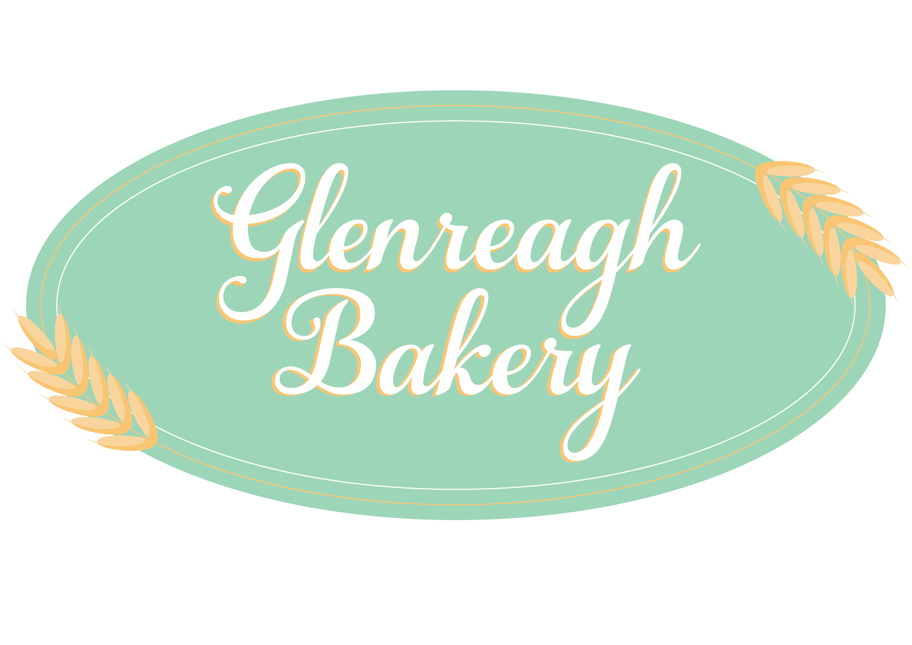

# Glenreagh Bakery

## Description
This is my final project for my Full Stack Flex Coding Bootcamp from University of Sydney.

In this project, I have created an e-commerce website for my personal use as I work in a small country bakery who is in need of a website. 

At the moment, there is only an e-commerce page and a home page in it, with the ability of logging in and signing up. However, in the future, there will be more pages including About and a Contact Us page. Making it into a fullly functioning bakery website that we can actually use for future business. Due to the current limited time of 10 days in this project, this MVP was the most that could be done within that timeframe.

## Logo


## Installation
To install and run this, please follow the steps below:
 ```
 1. Git clone this repo. 
 ```
 ```
 2. npm install 
 ```
 ```
 3. npm run develop 
 ```


## Deployed Link

https://glenreagh-bakery.herokuapp.com/

## Technologies Used
* React
* CSS
* Node.js
* Express
* MongoDB Atlas
* Heroku App

## License

[](https://opensource.org/licenses/MIT)

